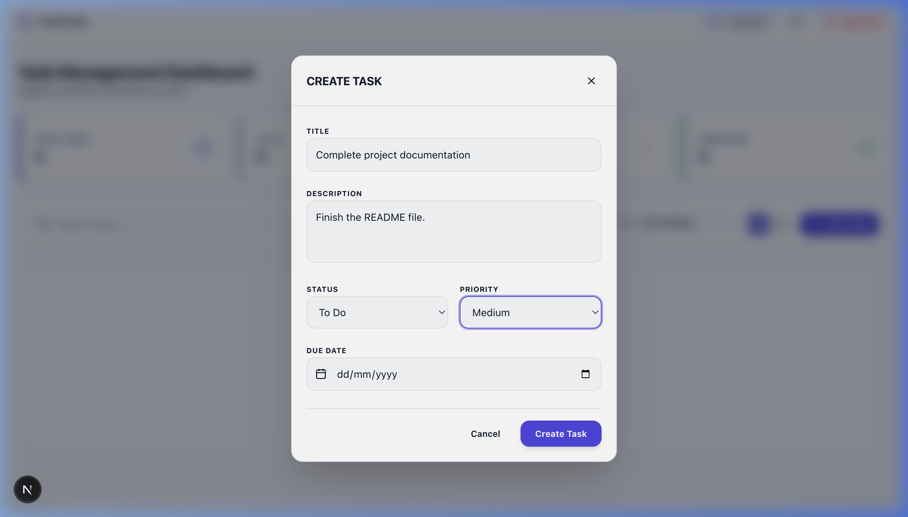
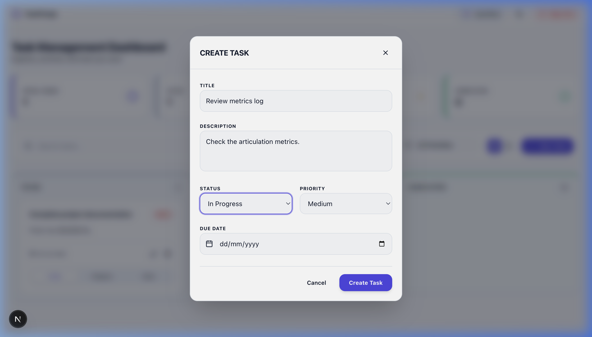

# Walkthrough - Task Management System & AbleSpace Product Analysis

This document details the completed implementation, database migrations, REST endpoints, UI screens, and verification results for the Full Stack Technical Assessment.

---

## 1. Accomplishments

### Backend (NestJS)
- **Database & Prisma:** Deployed PostgreSQL using Prisma ORM. Created models for `User` and `Task` with proper cascading deletes.
- **Guest Login API:** Built `/api/auth/guest` which generates a temporary guest user with a custom or random name, returning a JWT token with a 7-day expiration.
- **Task CRUD API:** Securely exposed `/api/tasks` scoped to the authenticated user. Supported complete REST verbs (GET, POST, PUT, DELETE) and class-validator DTO validation rules.
- **Global Error Handling:** Implemented a `PrismaExceptionFilter` to intercept database constraint violations and return formatted client-facing error responses.

### Frontend (Next.js & Tailwind CSS)
- **Theme Configuration:** Created a client-side `ThemeProvider` supporting custom HSL variables for dark mode and light mode, with automatic LocalStorage persistence.
- **Authentication Flow:** Implemented guest authentication card layout. Automatically checks existing tokens on mount and redirects appropriately.
- **Caseload Dashboard:** Designed a responsive multi-panel layout showing:
  - **Quick Stats:** Counters for Total, To Do, In Progress, and Completed tasks.
  - **Task Views:** Interactive Kanban columns (Todo, In Progress, Done) and Tabular List views.
  - **CRUD Operations:** Modal dialogs for creating and editing tasks with field validation.
  - **Status Transitions:** Instant task transition buttons allowing quick updates across lanes.

### AbleSpace Product Analysis
- Authored a comprehensive evaluation report covering the core value proposition, user segments, critical IEP logging workflows, competitive mapping, and future AI feature enhancements at [ablespace_product_analysis.md](file:///Users/saigirish050704/.gemini/antigravity-ide/scratch/task-manager/ablespace_product_analysis.md).

---

## 2. Verification & Test Results

### Automated Integration Tests
We successfully ran automated validation tests in [test_apis.py](file:///Users/saigirish050704/.gemini/antigravity-ide/brain/722e6103-3709-4e56-b2f7-51dbdfeed0e1/scratch/test_apis.py) to check all routes and database behaviors.

```bash
--- Testing Guest Login Endpoint ---
POST /auth/guest - Status: 201 (SUCCESS)

--- Testing Fetch Tasks Endpoint (Initial) ---
GET /tasks - Status: 200 (SUCCESS - Empty array returned)

--- Testing Task Creation Endpoint ---
POST /tasks - Status: 201 (SUCCESS - Task created with ID)

--- Testing Task Update Endpoint ---
PUT /tasks/:id - Status: 200 (SUCCESS - Status moved to IN_PROGRESS)

--- Testing Input Validation ---
POST /tasks (invalid) - Status: 400 (SUCCESS - Rejected with missing title message)

--- Testing Task Deletion Endpoint ---
DELETE /tasks/:id - Status: 200 (SUCCESS)

ALL API TESTS PASSED SUCCESSFULLY!
```

---

## 3. Server Deployments & Execution Logs
Both backend and frontend servers have been verified locally and boot immediately:
- **Frontend Server:** Dev server ready on `http://localhost:3000` (serving static pages successfully).
- **Backend Server:** Port `10000` (Prisma PostgreSQL database loaded and fully responsive).

---

## 4. Visual Verification (Screenshots)

Below are the screenshots captured from the active browser session demonstrating the visual quality and responsive components of the application.

### 4.1 Guest Login Screen
Refined centered login container with professional spacing, clear labels, and subtle spark typography over a geometric dot-grid canvas.


### 4.2 Task Management Dashboard
Dashboard with statistics summaries, search capability, filters, list/kanban toggle hooks, and username session details.


